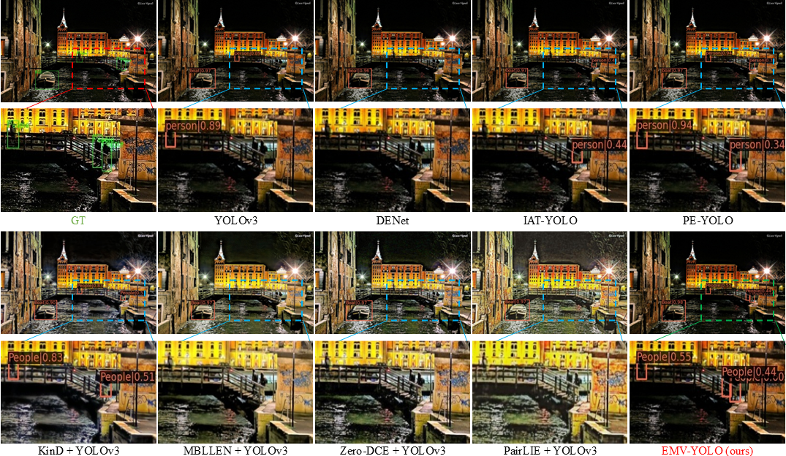

# [BMVC 2024] Toward Highly Efficient Semantic-Guided Machine Vision for Low-Light Object Detection
<p align="center">
<a href="https://paperswithcode.com/sota/2d-object-detection-on-exdark">
</a>
</p>
<!-- <p align="center">
<a href="https://paperswithcode.com/sota/hierarchical-text-segmentation-on-hiertext?p=hi-sam-marrying-segment-anything-model-for">
</a>
</p> -->
<p align="center">
<a href="https://bmva-archive.org.uk/bmvc/2024/papers/Paper_262/paper.pdf">📄 [Paper]</a>
<a href="https://bmva-archive.org.uk/bmvc/2024/papers/Paper_262/poster.pdf">🖼️ [Poster]</a>
</p>


---

## 🔍 Introduction


Object detectors trained on well-lit datasets often suffer from significant performance drops in low-light scenarios. To mitigate this issue, low-light enhancement techniques are typically employed. However, most existing methods are designed for human visual perception and fail to effectively utilize semantic information, while also incurring high computational costs.

To address these limitations, we propose **EMV (Efficient semantic-guided Machine Vision-oriented module)**—a highly efficient, machine vision-oriented approach tailored for low-light object detection. EMV is capable of dynamically adapting to detection tasks via end-to-end training and emphasizes semantically relevant features. Furthermore, it enhances images in the latent space via a lightweight architecture with only **27K parameters**, achieving both efficiency and speed.

We validate our approach through extensive experiments on the **ExDark** and **DarkFace** datasets, where EMV significantly boosts detection performance under low-light conditions.



---

## 🚀 Getting Started

### 📁 Dataset

**Step 1: Download the EXDark Dataset**

1. Download EXDark (with enhanced images using MBLLEN, Zero-DCE, KIND, PairLIE) in VOC format from [Baidu Netdisk](https://pan.baidu.com/s/12LXkObUyJ1qWemzRbA57RA?pwd=1234) (password: `1234`), or [Google Drive](https://drive.google.com/file/d/11TJmLxMWQazesTRXOyplwiFpteOEO9IS/view?usp=drive_link).

2. Unzip the dataset:
   ```bash
   unzip Exdark.zip
   ```

   The dataset is pre-split into **80% training** and **20% testing**.

3. The directory structure should look like:
   ```
   EXDark
   ├── JPEGImages
   │   ├── IMGS               # Original low-light images
   │   ├── IMGS_Kind          # Enhanced by KIND [MM 2019]
   │   ├── IMGS_ZeroDCE       # Enhanced by ZeroDCE [CVPR 2020]
   │   ├── IMGS_MBLLEN        # Enhanced by MBLLEN [BMVC 2018]
   │   ├── IMGS_PairLIE       # Enhanced by PairLIE [CVPR 2023]
   ├── Annotations
   ├── main
   ├── label
   ```

4. Modify the dataset path at [line 2 of this config](https://github.com/Zeng555/EMV-YOLO/blob/main/configs/_base_/datasets/exdark_yolo.py#L2) to match your local directory.

---

### 🧱 Environment Setup

**Step 1: Create Conda Environment**

```bash
conda create -n EMV-YOLO python=3.8 -y
conda activate EMV-YOLO
```

**Step 2: Install PyTorch (Tested on PyTorch 1.10.0)**

- **macOS**
  ```bash
  conda install pytorch==1.10.0 torchvision==0.11.0 torchaudio==0.10.0 -c pytorch
  ```

- **Linux / Windows**
  - CUDA 10.2:
    ```bash
    conda install pytorch==1.10.0 torchvision==0.11.0 torchaudio==0.10.0 cudatoolkit=10.2 -c pytorch
    ```
  - CUDA 11.3:
    ```bash
    conda install pytorch==1.10.0 torchvision==0.11.0 torchaudio==0.10.0 cudatoolkit=11.3 -c pytorch -c conda-forge
    ```
  - CPU Only:
    ```bash
    conda install pytorch==1.10.0 torchvision==0.11.0 torchaudio==0.10.0 cpuonly -c pytorch
    ```

**Step 3: Install Other Dependencies**

1. Install MMCV:
   > Choose the correct URL matching your CUDA and PyTorch version
   ```bash
   pip install mmcv-full==1.4.0 -f https://download.openmmlab.com/mmcv/dist/cu111/torch1.10.0/index.html
   ```

2. Install MMDetection (2.15.1) and other requirements:
   ```bash
   pip install opencv-python scipy
   pip install -r requirements/build.txt
   pip install -v -e .
   ```

---

## 🏋️‍♂️ Training

To train your model:
```bash
python tools/train.py configs/yolo/yolov3_EMV_Exdark.py
```


Multi GPU:
If you have multiple GPUs, you can opt for distributed training:

Usage:
```bash
bash tools/dist_train.sh <CONFIG> <GPU ID>
```
Example:
```bash
bash tools/dist_train.sh configs/yolo/yolov3_EMV_Exdark.py 0,1,2,3
```

---

## 🧪 Testing

To test your trained model:
```bash
python tools/test.py configs/yolo/yolov3_EMV_Exdark.py <YOUR_CHECKPOINT_PATH> --eval mAP
```

---

## 🙏 Acknowledgments

- This project is based on [MMDetection](https://mmdetection.readthedocs.io/en/latest/)
- Part of the code is adapted from [IAT](https://github.com/cuiziteng/Illumination-Adaptive-Transformer) – special thanks to the authors!

---

## 📣 Citation 

If you find our work helpful, please consider citing our paper. Thank you!
